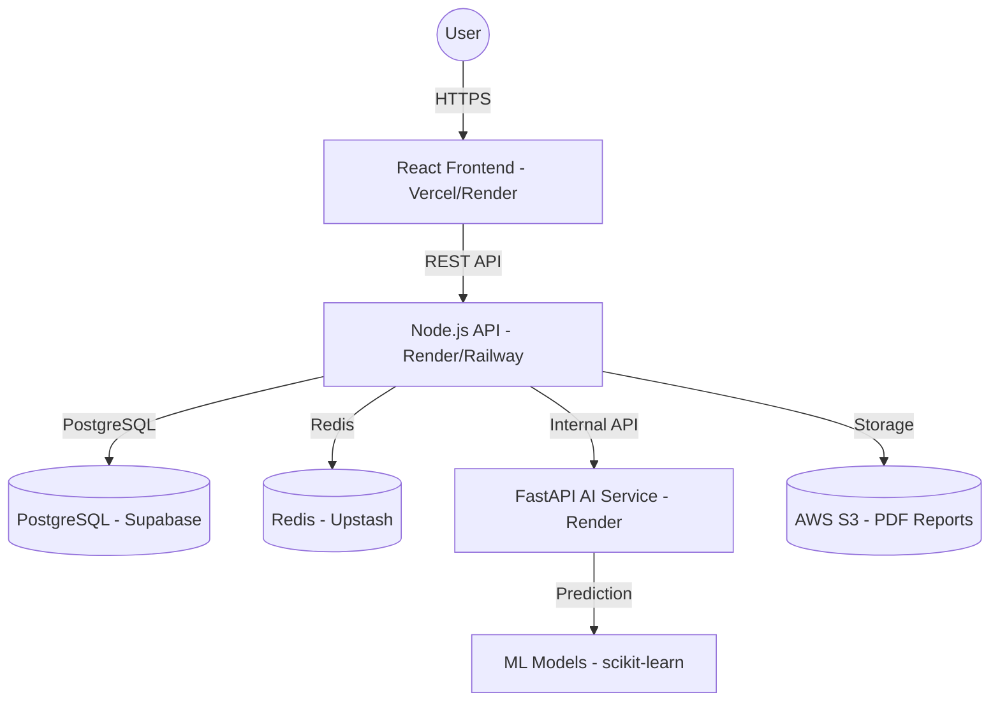

# 🚀 Lunara AI - Production Deployment Guide

This document provides a comprehensive roadmap for deploying the **Lunara AI** platform to production. 

## 🏗 System Architecture

---

## 📋 Infrastructure Requirements

| Service | Recommended Provider | Purpose |
| :--- | :--- | :--- |
| **Frontend** | Vercel | Fast global CDN for React/Vite |
| **API Backend** | Render | Managed Node.js service with auto-scaling |
| **AI Service** | Render | Managed Python service for ML inference |
| **Database** | Supabase | Production-grade PostgreSQL with backups |
| **Redis** | Upstash | Serverless Redis for Bull queues |
| **Storage** | AWS S3 | Secure storage for generated health reports |

---

## 🛠 Step 1: Data Infrastructure

### 1. PostgreSQL (Supabase)
1. Create a project at [supabase.com](https://supabase.com).
2. Note your **Transaction** connection string (Port 6543) for the `DATABASE_URL`.
3. Ensure the database password does not contain special characters that require URL encoding (or encode them).

### 2. Redis (Upstash)
1. Create a Redis instance at [upstash.com](https://upstash.com).
2. Use the **Global** database for low latency.
3. Enable **TLS** and copy the `rediss://...` connection string.

---

## 🚀 Step 2: AI Service (Python/FastAPI)

1. **Host**: Render (Web Service)
2. **Environment**: Python 3.11
3. **Build Command**: `pip install -r requirements.txt`
4. **Start Command**: `uvicorn app.main:app --host 0.0.0.0 --port $PORT`
5. **Config**:
   - Set **Root Directory** to `ai`.
   - Add these Environment Variables:
     - `PYTHON_VERSION`: `3.11.8` (Crucial for preventing build failures)
     - `OPENAI_API_KEY`: Your GPT-4o key.
     - `JWT_SECRET`: Same secret used by the Node API.
     - `LOG_LEVEL`: `INFO`

---

## 🚀 Step 3: API Service (Node.js/Express)

1. **Host**: Render (Web Service)
2. **Environment**: Node.js 20 LTS
3. **Build Command**: `npm install && npx prisma generate && npm run build`
4. **Start Command**: `npm run start`
5. **Config**:
   - Set **Root Directory** to `api`.
   - Add these Environment Variables:
     - `DATABASE_URL`: Your Supabase connection string.
     - `REDIS_URL`: Your Upstash connection string.
     - `AI_SERVICE_URL`: The URL of the service deployed in Step 2.
     - `JWT_SECRET`: Strong random string.
     - `JWT_REFRESH_SECRET`: Another strong random string.
     - `FRONTEND_URL`: Your Vercel frontend URL.
     - `AWS_ACCESS_KEY_ID` / `AWS_SECRET_ACCESS_KEY`: For S3.

---

## 🚀 Step 4: Frontend (React/Vite)

1. **Host**: Vercel or Render Static Site
2. **Build Command**: `npm run build`
3. **Output Directory**: `dist`
4. **Config**:
   - Set **Root Directory** to `frontend`.
   - Environment Variable:
     - `VITE_API_URL`: The URL of the API deployed in Step 3.

---

## 🔐 Post-Deployment Checklist

- [ ] **SSL/TLS**: Verify all traffic is served over HTTPS.
- [ ] **Prisma Migration**: Run `npx prisma migrate deploy` to sync the prod DB schema.
- [ ] **CORS**: Ensure the API `FRONTEND_URL` exactly matches the production frontend domain.
- [ ] **Rate Limiting**: Test that auth routes (Login/Register) trigger a 429 after 5 failed attempts.
- [ ] **Deep Health Check**: Call `GET /api/v1/health` and verify all services return `ok`.

---

## 📈 Monitoring

- **Errors**: Connect **Sentry** to both the Node and Python services.
- **Logs**: Monitor Render logs for `[ERROR]` or `[CRITICAL]` tags.
- **Uptime**: Use a service like **BetterStack** to ping the health endpoints every minute.

---

*For technical support, contact the Lunara AI Engineering Team.*
